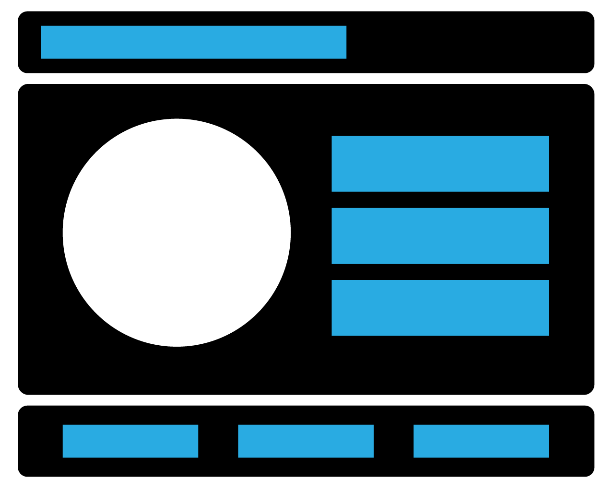

# Project-Zero-The Sandwich

### The Sandwich

- **A `README.md` file** with an explanation of what the project is and why you made it, your user stories, explanations of the technologies used, the approach taken, installation instructions, unsolved problems, the other components previously indicated (if applicable). In this project, also include your wireframes in the readme.
- A 10 minute presentation to your classmates and instructor, illustrating:
    - App functionality
    - Triumphs
    - Challenges
    - Words of Wisdom
    - Code snippets

### User Story
1. The user opens the site on the browser 
2. The user see a splash plage with a blank field and is asked to enter a name for their sandwich and press a submit button that says " "

3. The opacity will be removed and the user will see the sandwich game
    - The user's chosen name will be displayed in the header
4. The user will "meet" their sandwich as a Tea Sandwich and the user can start the game by clicking any button
5. The user will click one of three buttons to take care of the sandwich by meeting the sandwich's "needs"
    - The Feed button will run the feedMe() that will feed the sandwich and adjust the progress bar for the hunger metrics 
    - The Slice button will run the sliceMe() that will play with the sandwich to prevent boredom and adjust the progress bar for the boredom metrics 
    - The Ice button will run the iceMe() that will put the sandwich to bed and adjust the progress bar for the sleepiness metrics 
6. The user can see the "needs" of the sandwich in the progress bar
    - The sandwich's "needs" are rated 0-10, with 0 being the lowest and 10 the highest
    - As the user presses the Feed, Slice, or Ice buttons, the progress bar will increase to a max of 10
    - The progress bar will reduce from 10 every 2s
7. Every 1 minute, the user will see the sandwich age into a more mature sandwich
    - The sandwich starts as a tea sandwich
    - The first age will turn the sandwich into a club sandwich
    - The second age will turn the sandwich into a submarine sandwich (hoagie)
    - The "needs" increase in difficulty every time the sandwich matures 
8. If the user does not meet the "needs" of the sandwich, the sandwich will get modly and the game will be over
    - The mold will appear as a filter over the sandwich at it's present state
    - The user will be alerted of their failure with text that says "Game Over!" 
9. The user wins the game by meeting the "needs" the submarine sandwich  

### MVPs
**Technical Requirements**
Your app must:
1. HAVE ITS OWN REPO, under your github account. NOT A FORK. 👍
- **Git 20+ commits** Commit early, commit often. Tell a story with your commits. Each message should give a clear idea what you changed.
- **Include Wireframes and User Stories in the README**
- **Wireframe:** - Basically draw out what your game will look like—very different way it could look. You can use paper or any wireframe tool you find online.
- **User Stories** - Wording should center around how a user interacts with your game, for example:
    1. The user click starts and the level starts
    2. When the user hits the `f key` a fire ball is catuplulated at a target.
- **Render a game in the browser**
- **Include separate HTML / CSS / JavaScript files**
- Stick with **KISS (Keep It Simple Stupid)** and **DRY (Don't Repeat Yourself)** principles
- Use **JavaScript or jQuery** for **DOM manipulation**
- **Deploy your game online**, where the rest of the world can access it (we will show you how)
- Use **semantic markup** for HTML and CSS (adhere to best practices)
- Be reasonably complex

## **Necessary Deliverables**

- A working MVP (minium viable product) what is the absolute bare minimum functionality for you game, do not make it more complex until you've completed your MVP.
- A **working game, built by you**, hosted somewhere on the internet
- A **link to your hosted working game** in the URL section of your Github repo
- A **git repository hosted on Github**, with a link to your hosted game, and frequent commits dating back to the very beginning of the project.
- **A `README.md` file** with an explanation of what the project is and why you made it, your user stories, explanations of the technologies used, the approach taken, installation instructions, unsolved problems, the other components previously indicated (if applicable). In this project, also include your wireframes in the readme.
- A 10 minute presentation to your classmates and instructor, illustrating:
    - App functionality
    - Triumphs
    - Challenges
    - Words of Wisdom
    - Code snippets

## **Specifications**

1. Create a repo for your tomagotchi pet
2. Make a commit after you finish each one of the following: (commits should tell a story - commit early on often)
    - Instatiate your Tomagotchi
    - Display a character of your choice on the screen to represent your pet
    - Display the following metrics for your pet:
        - Hunger (1-10 scale)
        - Sleepiness (1-10 scale)
        - Boredom (1-10 scale)
        - Age
    - Add buttons to the screen to feed your pet, turn off the lights, and play with your pet.
    - Add the ability to name your pet.
    - Style the page.
    - Increase your pet's age every x minutes
    - Increase your pet's Hunger, Sleepiness, and Bored metrics on an interval of your choosing.
    - You pet should die if Hunger, Boredom, or Sleepiness hits 10.
    - Morph your pet at certain ages.
    - Animate your pet across the screen while it's alive.

## **Extras**

- Create a Class (JS Class, look at your notes if your forget) for your tomagotchi
- Have your tomagotchi give birth to baby tomagotchi...
- ...with special powers (extend the class)!
- Add an `excerise()` method to your tomagotchi, that affects certain properties
- Add anything you can think of... use your imagination!

### Milestones

### User Story

1. The user opens the site on the browser 
2. The user see a box with a blank field and is asked to enter a name for their sandwich and press a submit button that says " "
    - The field will have a max character count of 25
    - The field will be a layer on top of the main page that puts an opacity on top of the main page
3. The opacity will be removed and the user will see the sandwich game
    - The user's chosen name will be displayed in the header
4. The user will "meet" their sandwich as a Tea Sandwich
5. The user will click one of three buttons to take care of the sandwich by meeting the sandwich's "needs"
    - The Feed button will run the feedMe() that will feed the sandwich and adjust the progress bar for the hunger metrics 
    - The Slice button will run the sliceMe() that will play with the sandwich to prevent boredom and adjust the progress bar for the boredom metrics 
    - The Ice button will run the iceMe() that will put the sandwich to bed and adjust the progress bar for the sleepiness metrics 
6. The user can see the "needs" of the sandwich in the progress bar
    - The sandwich's "needs" are rated 0-10, with 0 being the lowest and 10 the highest
    - As the user presses the Feed, Slice, or Ice buttons, the progress bar will increase by 1 to a max of 10
    - The progress bar will reduce from 10 every 2s
7. Every 10 times the "needs" reach 10, the user will see the sandwich age into a more mature sandwich
    - The sandwich starts as a tea sandwich
    - The first age will turn the sandwich into a club sandwich
    - The second age will turn the sandwich into a submarine sandwich (hoagie)
    - The "needs" increase in difficulty every time the sandwich matures 
8. If the user does not meet the "needs" of the sandwich, the sandwich will get modly and the game will be over
    - The mold will appear as a filter over the sandwich at it's present state
    - The user will be alerted of their failure with text that says "Game Over!" 
9. The user wins the game by meeting the "needs" the submarine sandwich 

### Animation and CSS

- The hunger icon (representing meat, cheese, and veggies) will be one svg that I create 
- The slice icon (representing a knife) will be one svg that I create 
- The ice icon (representing a ice cube) will be one svg that I create 
- The icons will appear above their associated buttons and then fade after Xs
- The sandwich will acknowledge the buttons being push by a sound or animation TBD 
- The tea, club, and submarine sandwiches will be svgs that I create
- The sandwich will always be on the place in the middle of the screen 

### Extras
 - The user can feed their sandwitch by clicking the feedMe button that will randomly "feed" the sandwich one of three options: meat, cheese, and veggies (aka new hunger icons). 
-  The feedMe button will randomly generate a evil tomato every X feeds that will kill the sandwitch with a olive on a toothpick
- The hunger icons will appear at the top of the screen centered above the sandwitch and move vertically down the screen towards the sandwitch. 
- The FeedMe button 
- The sandwich will make a sound when it is fed, sliced, or iced
- The iceMe button will randomly generate a Smirdoff Ice and the sandwich will have a party and rebel against sleeping
    - a sound of a deep voiced man saying "iced" will occur along with music and those horns
- The submarine sandwich will evlove into a evil burrito that spits fire!
    - a new button will appear that will allow the user to feed the burrito hot sauce!
    - or throw a moldy avocado at it

### Wireframe

